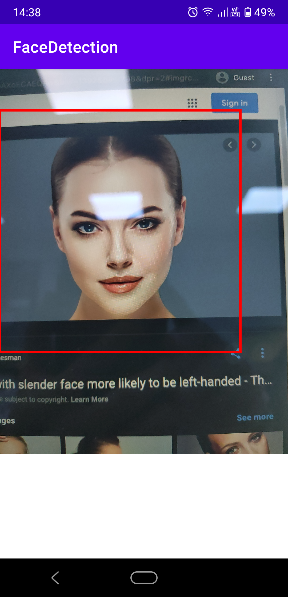

# Example of how to build a Face Detector with TF Lite C++ API on Android

This repo demonstrates how to use TF Lite to build a face detector with Java Native Interface (JNI). 
The pretrained [CenterFace model](https://github.com/Star-Clouds/CenterFace/blob/master/models/onnx/centerface.onnx) was used.
Model size has been reduced **from 7.18MB to 2.3MB** (by 68%).

## Repo structure
```
app/src/main/

├── assets
│   └── centerface_w640_h480.tflite
├── cpp
│   ├── CMakeLists.txt
│   ├── face-detection.cpp
│   ├── face-detection.h
│   ├── main-native-lib.cpp
│   └── tf-lite-api
│       ├── README.md
│       ├── generated-libs
│       │   ├── arm64-v8a
│       │   │   └── libtensorflowlite.so
│       │   └── armeabi-v7a
│       │       └── libtensorflowlite.so
│       ├── include
│       │   ├── abseil
│       │   ├── flatbuffers
│       │   └── tensorflow
│       │       └── lite
│       └── run_me.ipynb
└── java
    └── cuongvng
        └── facedetection
            └── MainActivity.java
```

- `app/src/main/assets` contains the TF Lite model `centerface_w640_h480.tflite`. 
The original ONNX model was converted to TF Lite format (converting flow: ONNX -> TF graph -> TF Lite).
- `app/src/main/cpp`: core functions of the app
    - `face-detection.h` and `face-detection.cpp` are the header and source files which implement the detecting functions
    - `main-native-lib.cpp` is the JNI file that wrap the core functions to call them from Java.
    -  `tf-lite-api/` contain the shared libraries (`.so`) and headers of TF Lite C++, including dependencies such as 
    [abseil](https://github.com/abseil/abseil-cpp/tree/110a80b0f01e6c013529661b433dc3f9ffe1df66) 
    and [flatbuffers](https://github.com/google/flatbuffers/tree/3b7d1e86b46e2e79715e0aab915e1ceaca958a8e).
    Details of how to build the libraries can be found on [this repo](https://github.com/cuongvng/TF-Lite-Cpp-API-for-Android).
- `app/src/main/java/cuongvng/facedetection/MainActivity.java`: High-level Android file, capturing frames from camera, call core functions via JNI.

## Results:
